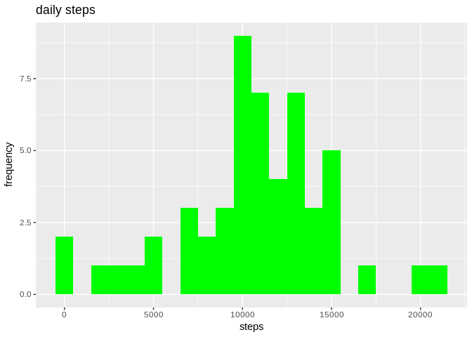
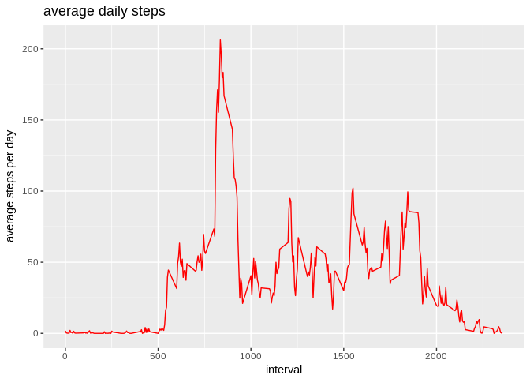
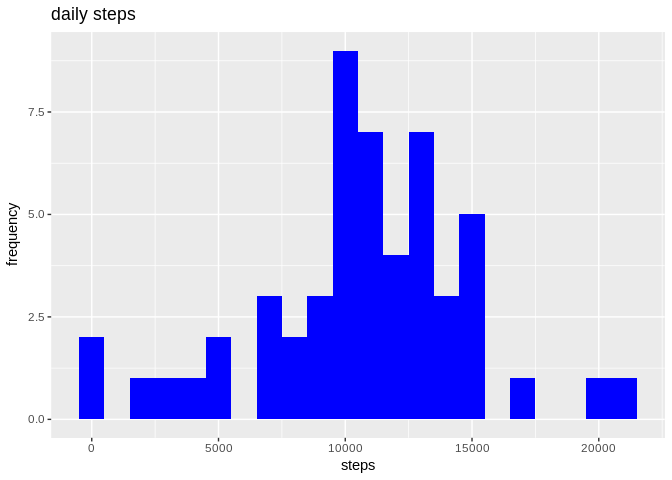
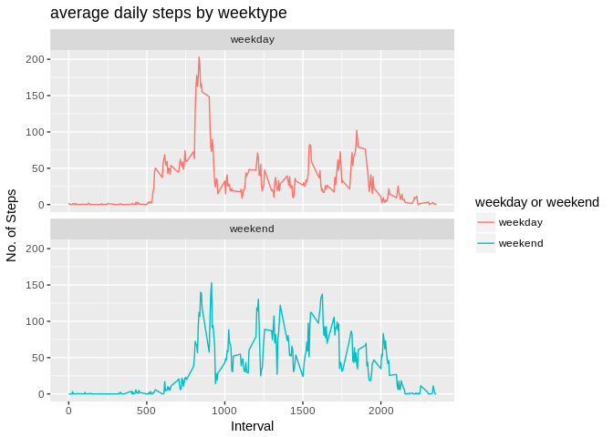

## Loading and preprocessing the data
Unzip data to obtain a csv file.


```r
library("data.table")
library(ggplot2)

if (!file.exists("data")) {
  dir.create("data")
}
fileUrl <- "https://d396qusza40orc.cloudfront.net/repdata%2Fdata%2Factivity.zip"
download.file(fileUrl, destfile = './data/activity.zip')
unzip("./data/activity.zip",exdir = "data")
```
## Reading csv Data into Data.Table. 

```r
activityData <- data.table::fread(input = "data/activity.csv")
```

## What is mean total number of steps taken per day?

1. total number of steps taken per day


```r
totalSteps <- activityData[, c(lapply(.SD, sum, na.rm = FALSE)), .SDcols = c("steps"), by = .(date)] 
head(totalSteps)
```

```
##          date steps
## 1: 2012-10-01    NA
## 2: 2012-10-02   126
## 3: 2012-10-03 11352
## 4: 2012-10-04 12116
## 5: 2012-10-05 13294
## 6: 2012-10-06 15420
```

2. Histogram of the total number of steps taken each day. 


```r
ggplot(totalSteps, aes(x = steps)) +
    geom_histogram(fill = "green", binwidth = 1000) +
    labs(title = "daily steps", x = "steps", y = "frequency")
```

```
## Warning: Removed 8 rows containing non-finite values (stat_bin).
```

<!-- -->

3. The mean and median of the total number of steps taken per day

```r
totalSteps[, .(meanSteps = mean(steps, na.rm = TRUE), medianSteps = median(steps, na.rm = TRUE))]
```

```
##    meanSteps medianSteps
## 1:  10766.19       10765
```


## What is the average daily activity pattern?

1.Time series plot of the 5-minute interval and the average number of steps taken


```r
intervalData <- activityData[, c(lapply(.SD, mean, na.rm = TRUE)), .SDcols = c("steps"), by = .(interval)] 

ggplot(intervalData, aes(x = interval , y = steps)) + geom_line(color="red") + labs(title = "average daily steps", x = "interval", y = "average steps per day")
```

<!-- -->

2. 5-minue interval with the maximum number of steps


```r
intervalData[steps == max(steps), .(max_interval = interval)]
```

```
##    max_interval
## 1:          835
```

## Imputing missing values

1. Total number of missing values in the dataset


```r
nrow(activityData[is.na(steps),])
```

```
## [1] 2304
```

2. Filling in all of the missing values in the dataset with the median for that day


```r
tidyActivityData <- activityData
tidyActivityData[is.na(steps), "steps"] <- tidyActivityData[, c(lapply(.SD, median, na.rm = TRUE)), .SDcols = c("steps")]
```

3. Create a new dataset that is equal to the original dataset but with the missing data filled in


```r
data.table::fwrite(x = tidyActivityData, file = "data/tidyData.csv", quote = FALSE)
```

4. Histogram of the total number of steps taken each day and the mean and median total number of steps taken per day

```r
# total number of steps taken per day
tidyTotalSteps <- tidyActivityData[, c(lapply(.SD, sum)), .SDcols = c("steps"), by = .(date)] 

# mean and median total number of steps taken per day
tidyTotalSteps[, .(meanSteps = mean(steps), medianSteps = median(steps))]
```

```
##    meanSteps medianSteps
## 1:   9354.23       10395
```

```r
# histogram of total steps taken 
ggplot(totalSteps, aes(x = steps)) + geom_histogram(fill = "blue", binwidth = 1000) + labs(title = "daily steps", x = "steps", y = "frequency")
```

```
## Warning: Removed 8 rows containing non-finite values (stat_bin).
```

<!-- -->

Type of Estimate | Mean_Steps | Median_Steps
--- | --- | ---
with na | 10766.19| 10765
with na set to the median | 9354.23 | 10395

Both the mean and median are lower when Na's are replaced with the mean

## Are there differences in activity patterns between weekdays and weekends?

1. New factor variable in the dataset with two levels – “weekday” and “weekend” indicating whether a given date is a weekday or weekend day.


```r
activityData[, date := as.POSIXct(date, format = "%Y-%m-%d")]
activityData[, `Day of Week`:= weekdays(x = date)]
activityData[grepl(pattern = "Monday|Tuesday|Wednesday|Thursday|Friday", x = `Day of Week`), "weekday or weekend"] <- "weekday"
activityData[grepl(pattern = "Saturday|Sunday", x = `Day of Week`), "weekday or weekend"] <- "weekend"
activityData[, `weekday or weekend` := as.factor(`weekday or weekend`)]
head(activityData)
```

```
##    steps       date interval Day of Week weekday or weekend
## 1:    NA 2012-10-01        0      Monday            weekday
## 2:    NA 2012-10-01        5      Monday            weekday
## 3:    NA 2012-10-01       10      Monday            weekday
## 4:    NA 2012-10-01       15      Monday            weekday
## 5:    NA 2012-10-01       20      Monday            weekday
## 6:    NA 2012-10-01       25      Monday            weekday
```

2. Time series plot of the 5-minute interval and the average number of steps taken, averaged across all weekday days or weekend days


```r
activityData[is.na(steps), "steps"] <- activityData[, c(lapply(.SD, median, na.rm = TRUE)), .SDcols = c("steps")]
intervalData <- activityData[, c(lapply(.SD, mean, na.rm = TRUE)), .SDcols = c("steps"), by = .(interval, `weekday or weekend`)] 

ggplot(intervalData , aes(x = interval , y = steps, color=`weekday or weekend`)) + geom_line() + labs(title = "average daily steps by weektype", x = "Interval", y = "No. of Steps") + facet_wrap(~`weekday or weekend` , ncol = 1, nrow=2)
```

<!-- -->
